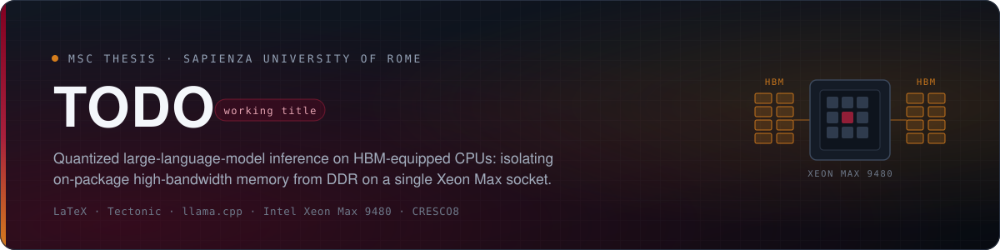

<p align="center">
  
</p>

<p align="center">
  <a href="LICENSE"></a>
  
  
  
  
</p>

<p align="center">
  <a href="thesis/"><b>Thesis</b></a> ·
  <a href="slides/"><b>Slides</b></a> ·
  <a href="research/README.md"><b>Research</b></a> ·
  <a href="research/analysis/README.md"><b>Gap analysis</b></a> ·
  <a href="bibliography/references.bib"><b>Bibliography</b></a>
</p>

---

## What this thesis argues

The Intel Xeon Max 9480 puts 64 GB of HBM on the CPU package. The literature
establishes the pieces of the picture separately, and never joins them:

- **Na et al.** show CPU-only LLM inference on Xeon Max can be competitive, but
  vary hardware and software factors together and never isolate HBM from DDR,
  nor evaluate quantized `llama.cpp`.
- **Ibeid et al.** measure the memory tiers on the same hardware — local HBM far
  above DDR on STREAM, with strong placement dependence — but not LLM inference.
- **Goto et al.** stage HPL data in HBM at Aurora scale without reporting an
  isolated HBM effect.

So the claim "HBM helps LLM inference on CPUs" is currently an inference across
papers, not a measurement. **This thesis makes it a measurement:** hold the
socket, model, quantization, runtime, prompt and decoding settings fixed, change
only the memory-node policy, verify page residency, and report prefill and decode
separately. The point is not that CPUs beat GPUs, nor a new inference runtime —
it is controlled evidence about *when* the memory tier matters, and why.

The work is organised as four ranked questions, each gated on the previous one:

| | Question | Role |
|---|---|---|
| **RQ1** | How do verified local-HBM and local-DDR placement affect prefill and sustained decode, all else equal? | Primary empirical contribution |
| **RQ2** | How does the benefit change as the live set approaches and crosses usable HBM capacity, and which component causes the transition? | Capacity envelope |
| **RQ3** | Can explicit execution and page placement avoid the regressions seen with unmanaged multi-socket / SNC configurations? | Secondary |
| **RQ4** | Once the live set exceeds HBM, can explicit placement of weights and KV state beat the best unmodified whole-process policy? | Conditional systems contribution |

A null result is informative in each case, and the hypotheses are pre-registered
in the gap analysis. Measurements run on the **CRESCO8** Xeon Max partition;
the full reasoning lives in [`research/`](research/README.md).

## Building

Requires [Tectonic](https://tectonic-typesetting.github.io/) and
[Invoke](https://www.pyinvoke.org/):

```bash
brew install tectonic && pip install -r requirements.txt
```

Then, from the repository root:

| Command | Builds |
|---|---|
| `inv thesis` | `build/thesis.pdf` — the thesis |
| `inv slides` | `build/slides.pdf` — the defence deck |
| `inv notes` | `build/technical-background.pdf` — hardware, platform and literature notes |
| `inv analysis` | `build/research-gap-analysis.pdf` — the critical review and research gap |
| `inv briefings` | Every dated supervisor briefing in `research/briefings/` |
| `inv all` | All of the above |
| `inv list` | Lists every buildable document |
| `inv clean` | Removes `build/` |

Add `--open-pdf` to any single-document task to open the result on success, and
`inv briefings --name <stem>` to build one briefing. Every PDF lands in `build/`;
nothing is ever written back into the source tree.

## License

[MIT](LICENSE) © Lucian D. Crainic
